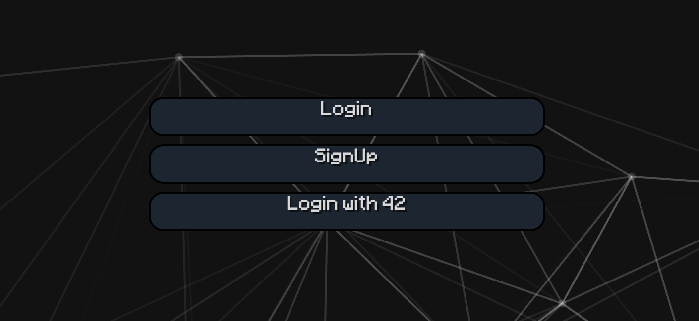
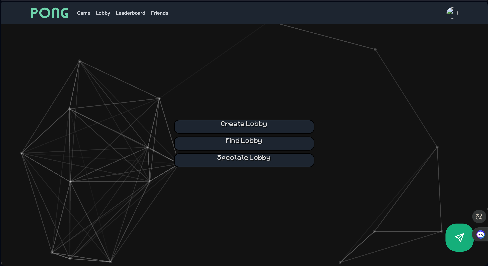
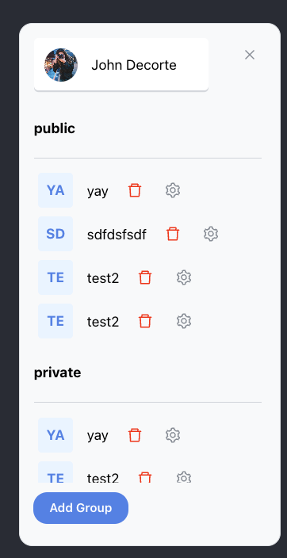
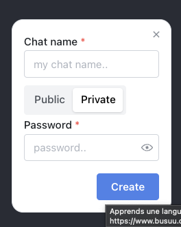

<h1 align="center">
	📖 Transcendence
</h1>

<p align="center">
	<b><i>Modern online pong</i></b><br>
</p>

<p align="center">
	
	
	
	
	
</p>

Transcendence is a onepage fullstack website where you can play pong with players among other things such as  JWT / 2fa authentification, a chat, private messages, friends list, profiles, a match-making system, a spectating system and modifications to the pong game such as different background and gamemodes.

The project uses the following technologies:
- **React**
- **NestJS**
- **PostgreSQL with GraphQL**

# Usage

**Before starting**, please replace the `FORTYTWO_ID`, `FORTYTWO_SECRET` and `AUTH_CALLBACK` variables in `stage.dev.env` with your own (from the 42 API).<br>
Then, run the following command for the back and the front:

```bash
docker-compose up --build
```

If everything went well, you should be able to access the website at `http://localhost:8080`.
> If you'd like to modify additional settings, please feel free to do so in the others environment files.

> Upon first launch, you will be asked to authenticate with your 42 account.


# API

Our API utilizes GraphQL, an open-source data query and manipulation language for APIs. It provides a more efficient, powerful, and flexible alternative to the REST API.

GraphQL allows clients to request exactly the data they need, making it possible to get all the required data in a single request. Unlike REST APIs where you would typically retrieve data from multiple endpoints, GraphQL APIs use a single endpoint and rely on a query language to specify the data needed.

Here’s how to interact with our GraphQL API:

1. **Endpoint**: The API is accessible via a single endpoint, which can be used to make queries and mutations.

2. **Queries**: To retrieve data, you can send queries to the API. A query specifies the exact fields and objects you want to fetch. This ensures that you receive only the data you need, nothing more, nothing less.

3. **Mutations**: For operations that cause changes, such as inserting or updating data, you use mutations. This is similar to POST, PUT, PATCH, and DELETE requests in a REST API.

4. **Authorization**: To access the API, you need to be authorized. The authorization process typically involves sending a token (obtained after logging in) in the header of your request.

5. **Tools**: You can explore and test our GraphQL API using tools like GraphiQL or Apollo Studio. These platforms provide a user-friendly interface to construct queries and mutations, and to view the schema.

6. **Real-time Data with Subscriptions**: GraphQL also supports subscriptions, allowing clients to receive real-time updates when data changes.

For a detailed understanding of our API, refer to our documentation. It includes examples of queries, mutations, and subscriptions, along with the necessary schema definitions and authorization details.


### Password Encryption with bcrypt

In our application, we prioritize the security of user data, especially when it comes to sensitive information like passwords. To ensure the highest level of security, we use bcrypt for password encryption. 

#### Why bcrypt?

- **Security**: bcrypt is a robust and reliable password hashing function. It incorporates a salt to protect against rainbow table attacks and has a slow hash function which is a key feature to defend against brute-force attacks.
- **Salting**: Automatically generated salts are added to each password before hashing. This means that even if two users have the same password, their hashed passwords will be different.
- **Adaptability**: As hardware gets faster, bcrypt can increase the cost factor, making the hash function slower and thus more resistant to attacks.

#### How We Use bcrypt:

- **Hashing on Registration**: When a user registers, their password is immediately hashed using bcrypt before it's stored in our database. This means we never store plain-text passwords.
- **Verification on Login**: During login, the provided password is hashed with the same salt and compared to the stored hash to verify the user's identity.
- **Security Updates**: We stay updated with the latest security practices and bcrypt versions to ensure ongoing protection.

By using bcrypt, we're committed to maintaining a high level of security and safeguarding our users' data effectively.

# Docs

**NESTJS** documentation is available at `https://docs.nestjs.com/`.<br>
**SWAGGER** (OAS 3.0) documentation is available at `https://swagger.io/specification/`. (I Heavily recommend the use of https://editor.swagger.io)<br>
**TYPEORM** documentation is available at `https://typeorm.io/`.<br>
# Screenshots




